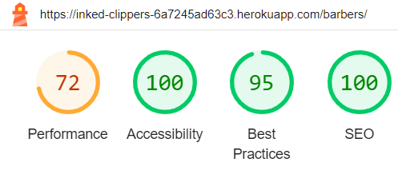

# Contents

* [Manual Testing]()

* [Validation](#validation)

* [Lighthouse](#lighthouse)

* [Wave](#wave)

* [Bugs]()

# Validation

## HTML Validation

Home page

* 

About page

* 

Barber page

* 

Tattoo page

* 

Register page

* 

Login page

* 

Logout page

* 

Profile page

* 

Add testimonial

* 

Edit testimonial

* 

Testimonial detail

* 

Delete testimonial

* 

## CSS Validation

Main CSS

* 

## Python Validation

### Inked clippers app

Inked clippers app settings.py

* 

Inked clippers app urls.py

* 

Core app models.py

* 

### Core app

Core app urls.py

* 

Core app views.py

* 

Core app forms.py

* 

### Users app

Users app models.py

* 

Users app views.py

* 

Users app forms.py

* 

Users app signals.py

* 

### barber_services.py

barber_services.py

* 

### tattoo_services.py

tattoo_services.py

* 

###

# Lighthouse 

Home page

* Desktop
  * 

* Mobile
  * 

About page

* Desktop
  * 

* Mobile
  * 

Barbers page

* Desktop
    * 

* Mobile
    * 

Tattoo page

* Desktop
    * 

* Mobile
    * 

Profile page

* Desktop
    * 

* Mobile
    * 

Register page

* Desktop
    * 

* Mobile
    * 

Login page

* Desktop
    * 

* Mobile
    * 

Add testimonial page

* Desktop
    * 

* Mobile
    * 

Edit testimonial page

* Desktop
    * 

* Mobile
    * 

Delete testimonial page

* Desktop
    * 

* Mobile
    * 

Testimonial detail page

* Desktop
    * 

* Mobile
    * 

Logout page

* Desktop
    * 

* Mobile
    * 

###

# Wave

Home page

* 

About page

* 

Barbers page

* 

Tattoo page

* 

Register page

* 

Login page

* 

Profile page

* 

Add testimonial page

* 

Testimonial detail page

* 

Edit testimonial page

* 

Delete testimonial page

* 

Logout page

* 

