# Contents

* [Manual Testing](#manual-testing)

* [Responsiveness](#responsiveness)

* [Browsers](#)

* [Validation](#validation)

* [Lighthouse](#lighthouse)

* [Wave](#wave)

# Manual Testing

### Nav Bar

| Feature | User Action | Expected Result | Desktop Pass/Fail | Mobile Pass/Fail
| :---| :---| :---| :---| :---|
| Logo | Clicking on the Inked Clippers Logo | Redirects to the Home page | Pass | Pass |
| Home | Clicking on the home link | Redirects to the Home page | Pass | Pass |
| About | Clicking on the about link | Navigates to the About page | Pass | Pass |
| Barbers | Clicking on the barbers link | Navigates to the Barbers page | Pass | Pass |
| Tattoo | Clicking on the tattoo link | Navigates to the Tattoo page | Pass | Pass |
| Register | Clicking on the Register link | Navigates to the Register page | Pass | Pass |
| Login | Clicking on the Login link | Navigates to the Login page | Pass | Pass |
| Profile | Clicking on the Profile link | Navigates to the Profile page | Pass | Pass |
| Logout | Clicking on the logout link | Logs out the user | Pass | Pass |

### Footer

| Feature | User Action | Expected Result | Desktop Pass/Fail | Mobile Pass/Fail
| :---| :---| :---| :---| :---|
| Facebook Icon | Clicking on the Facebook icon | Opens Facebook.com | Pass | Pass |
| Twitter Icon | Clicking on the Facebook icon | Opens Twitter.com | Pass | Pass |
| Linkedin Icon | Clicking on the Facebook icon | Opens my Linkedin profile | Pass | Pass |
| Github Icon | Clicking on the Facebook icon | Opens the Inked Clippers repository | Pass | Pass |
| Phone number link | Clicking on Inked Clippers phone number | Asks the user to make a call with there chosen application | Pass | Pass |
| Email Address link | Clicking on Inked Clippers email address | Asks the user to open mail or gmail for sending an email | Pass | Pass |

### Home Page

| Feature | User Action | Expected Result | Desktop Pass/Fail | Mobile Pass/Fail
| :---| :---| :---| :---| :---|
| Down Arrow Button | When the user clicks the arrow pointing down | The user will be brought down to the testimonials section | Pass | Pass
| Paignation buttons for testimonials | When the user clicks the button 1, 2 or 3, | The user will be brought to the next section of testimonials | Pass | Pass
| Location Area | None | Location is displaying and the user can zoom and move around the map  | Pass | Pass

### Tattoo Page

| Feature | User Action | Expected Result | Desktop Pass/Fail | Mobile Pass/Fail
| :---| :---| :---| :---| :---|
| Faq's buttons | The user clicks the arrow button to see more information for the common question | The Box extends to show the answer to the question | Pass | Pass
| | The user clicks the arrow button to hide the answer to the question | The Box closes | Pass | Pass
|  | The user clicks the arrow button for another question while having the last question box open | The previously viewed question will close and the new question will open | Pass | Pass

### Register Page

| Feature | User Action | Expected Result | Desktop Pass/Fail | Mobile Pass/Fail
| :---| :---| :---| :---| :---|
| Account registration form | The user fills out the form to create an account | An account is created for the user | Pass | Pass |
| | The user trys to create an account with a username that is already registered | An error pops up in red telling the user "A user with that username already exists" | Pass | Pass |
| |  If the user trys to sign up with an email already registered | The user is unable to create an account and has to pick a email that is not already registered | Fail | Fail |
| Sign up button | The user clicks the sign up button to create an account | The users account is created and they are logged in and redirected to the home page | Pass | Pass |
| Already have an account? Sign in | When the user already has an account and click the sign in link | The user is redirected to the login page | Pass | Pass |

### Login Page

| Feature | User Action | Expected Result | Desktop Pass/Fail | Mobile Pass/Fail
| :---| :---| :---| :---| :---|
| Login form | The user trys to login with an account that doesnt exist or with the wrong password | An error message pops up telling the user to "Please enter a correct username and password. Note that both fields may be case-sensitive." | Pass | Pass |
| Sign up button | The user click enters there login information and clicks Login | The user is logged in and redirected to the home page | Pass | Pass |
| Create An Account? Sign up link | The user doesnt have an account and clicks sign up | The user is redirected to the Register page | Pass | Pass |

### Profile Page

| Feature | User Action | Expected Result | Desktop Pass/Fail | Mobile Pass/Fail
| :---| :---| :---| :---| :---|
| Update profile form | The user updates there profile | The page refreshes and the profile is updated | Pass | Pass |
| | The user try to change there name to an already taken name | An error message pops up telling the user "A user with that username already exists." | Pass | Pass |
| Update button | After changing the user information the user click update | The page refreshes and the profile is updated | Pass | Pass |
| Leave a review button | The user clicks the leave review button | The user is redirected to the add testimonial page | Pass | Pass |
| User testimonial link | The user clicks the content inside there own testimonial | The user is redirected two the testimonial detail page | Pass | Pass |
| Edit testimonial button | The user clicks the edit testimonial button | The user is redirected to the edit testimonial page | Pass | Pass |
| Delete testimonial button | The user clicks the delete testimonial button | The user is redirected to the delete testimonial page | Pass | Pass |

### Add Testimonial Page

| Feature | User Action | Expected Result | Desktop Pass/Fail | Mobile Pass/Fail
| :---| :---| :---| :---| :---|
| Add Testimonial Form | The user has a section to leave a review | The user can leave a review in the box | Pass | Pass
| | The user wants to leave a rating | The website has a select box with a star rating system | Pass | Pass
| | The user wants to rate the employee that they got a service from | The page has a drop down box with the employees name | Pass | Pass
| | The user wants to choose the service they got | The user has the option from Barber Tattoo Artist or Piercer | Pass | Pass
| Submit Button | When the user is finshed they press the Submit button | The review is added to the home page and to the users profile | Pass | Pass

### Testimonial Detail Page

| Feature | User Action | Expected Result | Desktop Pass/Fail | Mobile Pass/Fail
| :---| :---| :---| :---| :---|
| Edit button | The user clicks the edit button | The user is take to the edit testimonial page | Pass | Pass
| Delete button | The user clicks the delete button | The users testimonial is deleted | Pass | Pass

### Edit Testimonial Page

| Feature | User Action | Expected Result | Desktop Pass/Fail | Mobile Pass/Fail
| :---| :---| :---| :---| :---|
| Edit testimonial form | The user wants to edit there own testimonial | The testimonial form comes pre filled with the selected testimonial information | Pass | Pass
| Update button | The user has updated there testimonial and clicked update | The testimonial is updated and the user is redirected to the testimonial detail page | Pass | Pass

### Delete Testimonial Page

| Feature | User Action | Expected Result | Desktop Pass/Fail | Mobile Pass/Fail
| :---| :---| :---| :---| :---|
| Delete button | The user clicks the delete button | The users testimonial is deleted | Pass | Pass
| Retun home button | The user clicks the return home button | The users testimonial remains the same and the user is redirected to the home page | Pass | Pass

### Logout Page

| Feature | User Action | Expected Result | Desktop Pass/Fail | Mobile Pass/Fail
| :---| :---| :---| :---| :---|
| Sign in link | The user logs out and click the sign in link | The user is redirected to the login page | Pass | Pass

# Responsiveness

I tested through all these devices with [Responsive Design Checker](https://responsivedesignchecker.com/)

### Desktop

| Screen Size | Pass/Fail |
| :---| :---|
| 32" | Pass |
| 24" | Pass |
| 22" | Pass |
| 20" | Pass |
| 15" | Pass |
| 13" | Pass |
| 10" | Pass |

### Mobile

| Device | Pass/Fail |
| :---| :---|
| Apple iPhone 3/4/4s | Pass |
| Apple iphone 6/6s/7 | Pass |
| Samsung Galaxy S5/S6/S7 | Pass |
| Nexus 4 | Pass |
| Google Pixel | Pass |

# Browsers

| Browser | Pass/Fail |
| :---| :---|
| Chrome | Pass |
| Fire Fox | Pass |
| Safari | Pass |
| Edge | Pass |
| Opera | Pass |

# Validation

## HTML Validation

For testing the **HTML** code I used [W3C Validator](https://validator.w3.org/). After fixing a few small errors the HTML code is error free with no warnings.

Home page

* 

About page

* 

Barber page

* 

Tattoo page

* 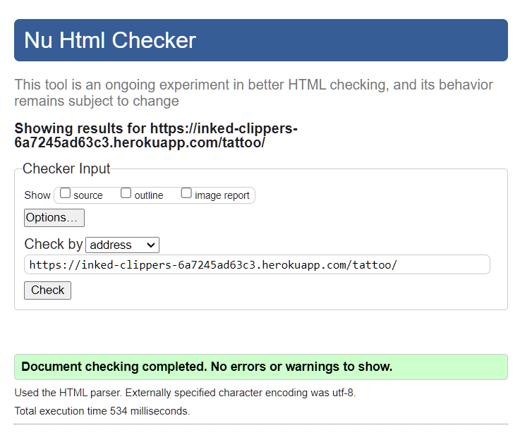

Register page

* 

Login page

* 

Logout page

* 

Profile page

* 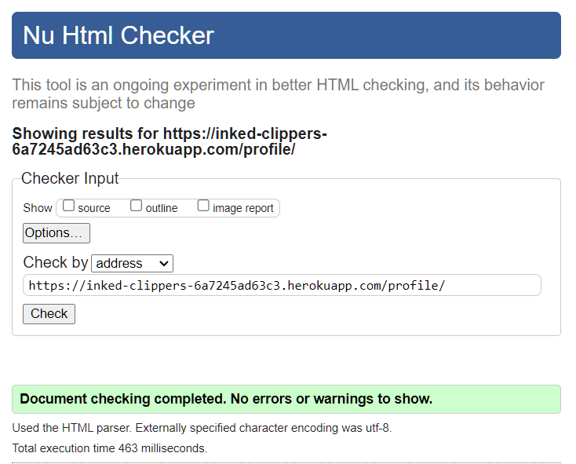

Add testimonial

* 

Edit testimonial

* 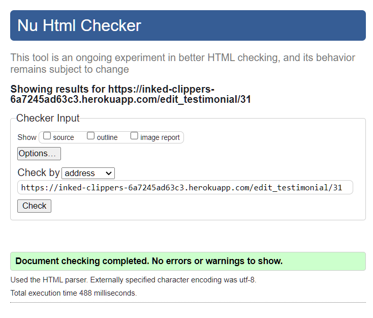

Testimonial detail

* 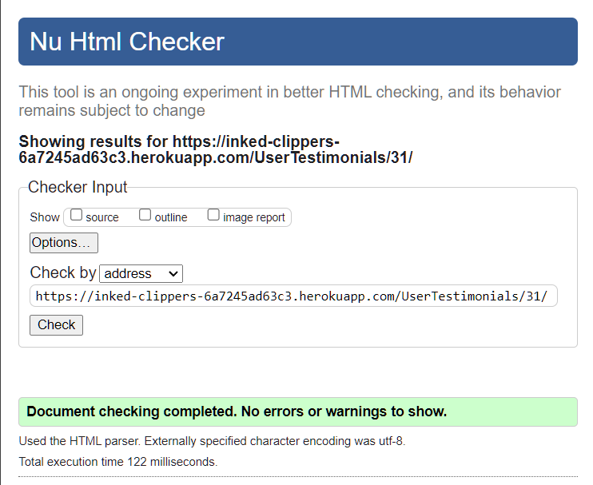

Delete testimonial

* 

## CSS Validation

For testing the **CSS** code I used [W3C Jigsaw](https://jigsaw.w3.org/css-validator/) The **CSS File** has no errors.

Main CSS

* 

## Python Validation

For testing the python code I used [Code Institutes CI Python Linter](https://pep8ci.herokuapp.com/)

* Warnings
    * Settings.py
        * Six warnings of line too long.
    * user app models.py
        * I couldnt do anything about this error because it was a link that was too long.

### Inked clippers app

Inked clippers app settings.py

* 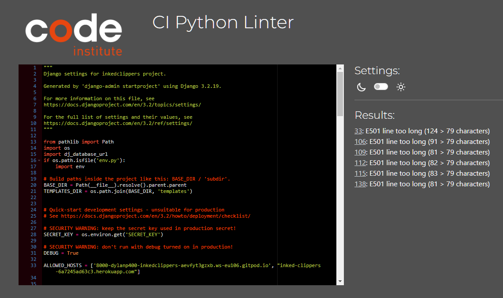

Inked clippers app urls.py

* 

Core app models.py

* 

### Core app

Core app urls.py

* 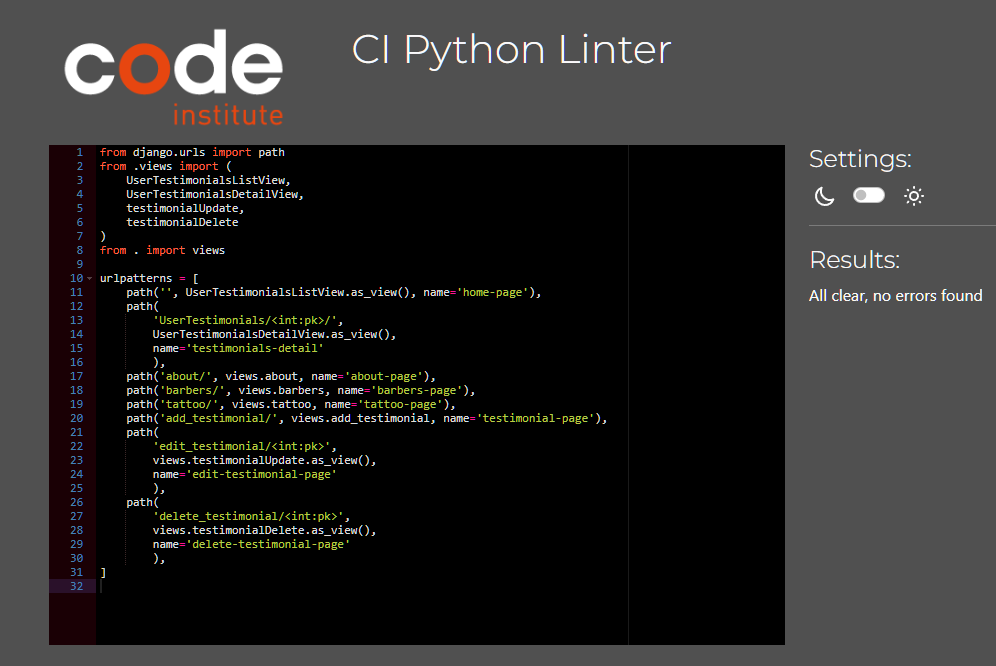

Core app views.py

* 

Core app forms.py

* 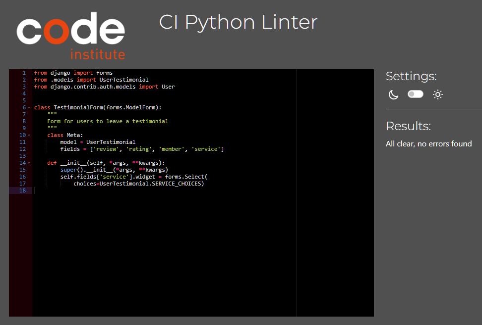

### Users app

Users app models.py

* 

Users app views.py

* 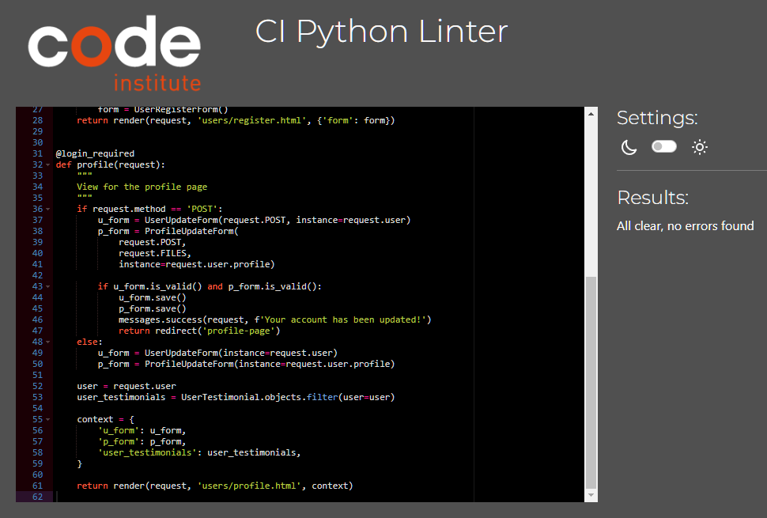

Users app forms.py

* 

Users app signals.py

* 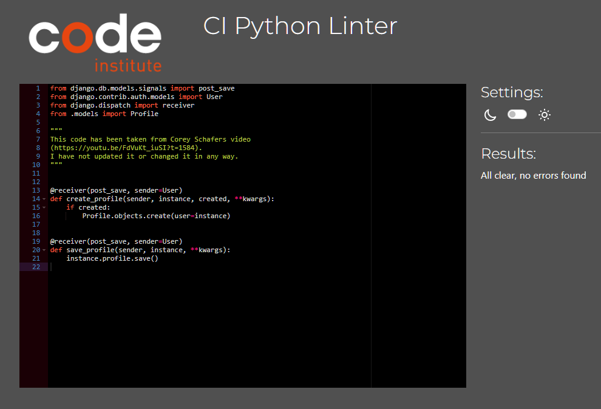

### barber_services.py

barber_services.py

* 

### tattoo_services.py

tattoo_services.py

* 

###

# Lighthouse

Lighthouse scores are all in the high 90s and green.

Home page

* Desktop
  * 

* Mobile
  * 

About page

* Desktop
  * 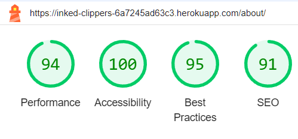

* Mobile
  * 

Barbers page

* Desktop
    * 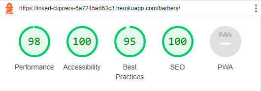

* Mobile
    * 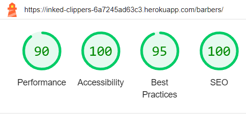

Tattoo page

* Desktop
    * 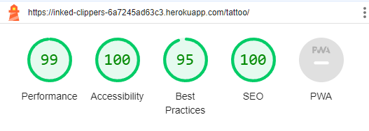

* Mobile
    * 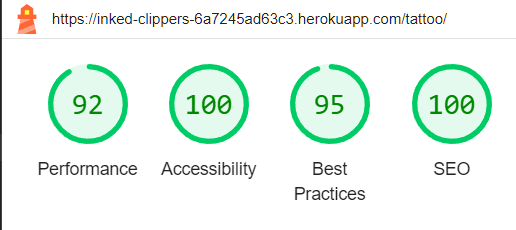

Profile page

* Desktop
    * 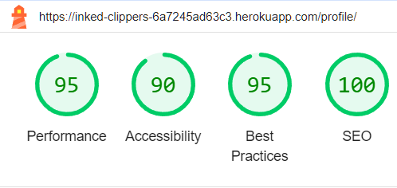

* Mobile
    * 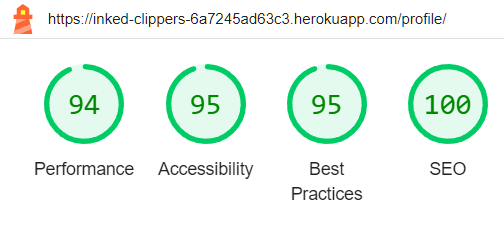

Register page

* Desktop
    * 

* Mobile
    * 

Login page

* Desktop
    * 

* Mobile
    * 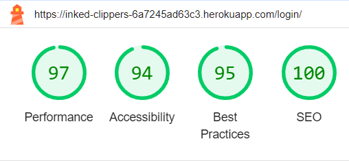

Add testimonial page

* Desktop
    * 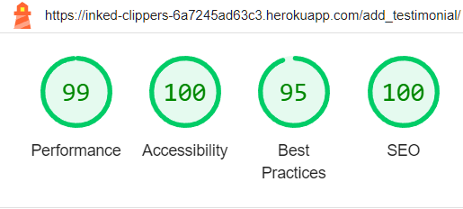

* Mobile
    * 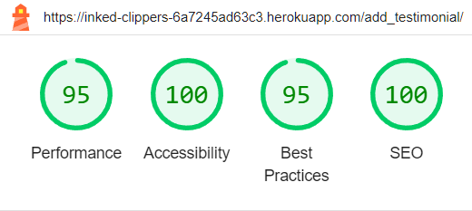

Edit testimonial page

* Desktop
    * 

* Mobile
    * 

Delete testimonial page

* Desktop
    * 

* Mobile
    * 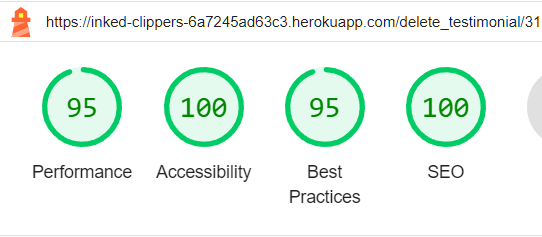

Testimonial detail page

* Desktop
    * 

* Mobile
    * 

Logout page

* Desktop
    * 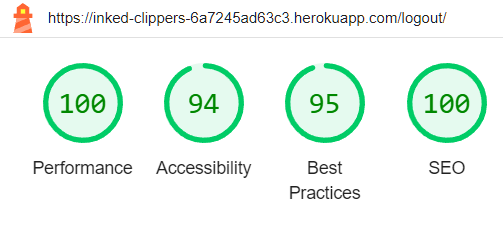

* Mobile
    * 

###

# Wave

Home page

* 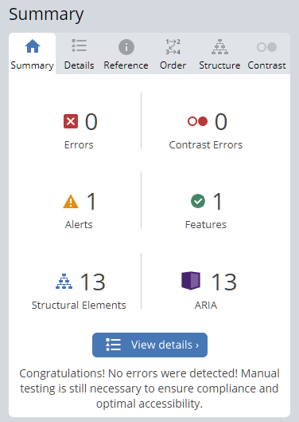

About page

* 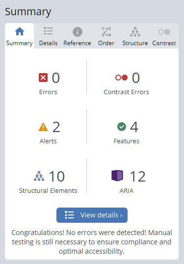

Barbers page

* 

Tattoo page

* 

Register page

* 

Login page

* 

Profile page

* 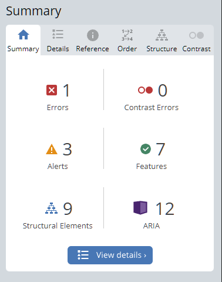
* I have one empty link error I have a bug in the profile information form it has a section for the currently selected profile photo but it doesnt show the name of the image and it is empty and got flagged by wave

Add testimonial page

* 

Testimonial detail page

* 

Edit testimonial page

* 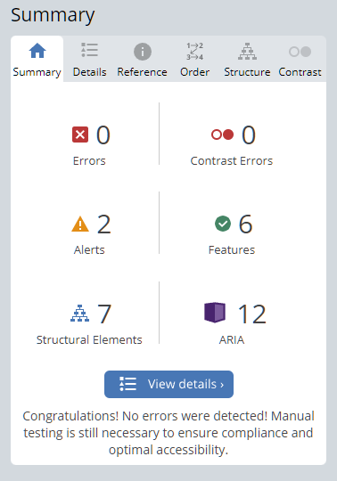

Delete testimonial page

* 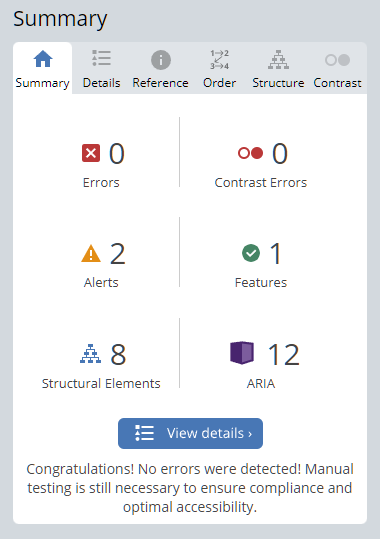

Logout page

* 

